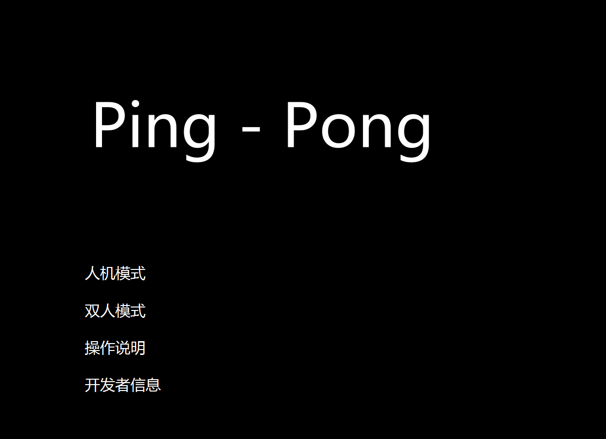

# Ping_Pong_Game

项目地址：[SunJianBai/PingPongGame: 这是一个类似乒乓球的小游戏，可以双人对战或者人机对战](https://github.com/SunJianBai/PingPongGame)

## 游戏功能

- [x] 游戏菜单
- [x] 物理碰撞
- [x] AI逻辑
- [x] 双人对战
- [x] 碰撞音效
- [ ] 网络联机
- [ ] ……


------

## 1. 程序的运行环境、安装步骤

### （1）运行环境

- **JDK 17**：程序使用Java开发，要求安装JDK 17或更高版本。
- **操作系统**：程序支持Windows操作系统。
- **FXGL**：用于游戏开发的Java框架。

### （2）程序的组成部分

- **主程序文件**：`PingPong.jar`（游戏主程序JAR文件）。
- 依赖库文件：
  - **FXGL.jar**：用于游戏开发的FXGL框架。
  - **音效文件**：WAV格式的音效文件。

### （3）安装步骤

1. 安装 **JRE 17**（如果未安装）。

2. 在命令提示符中，进入`可执行jar包`文件夹。

3. 输入以下命令运行程序：

   ```bash
   java -jar PingPong.jar
   ```

4. 或者，直接双击 `run.bat` 文件，程序将自动启动。

5. 或者，在`exe文件`文件夹，双击`Pong.exe`文件运行。

------

## 2. 程序开发平台

### （1）代码行数

- **约2000行代码**。

### （2）开发环境

- **IDE**：IntelliJ IDEA 2022.2
- **JDK**：JDK 17
- **框架**：FXGL用于游戏开发。

------

## 3. 程序功能说明

### （1）UML用例图

- **用户类型**：

  1. **玩家**：启动游戏、选择游戏模式（单人或双人）、控制球拍、设置游戏参数（如难度、音效）、查看游戏结果。
  2. **AI**：自动控制球拍，根据难度进行不同策略的响应。

  

### （2）重点功能截图和说明

- **菜单界面**：通过菜单选择要进行的游戏方式。

  

- **人机难度选择**：玩家可以选择不同难度的AI进行游戏

  

- **双人对战**：支持两名玩家在同一设备上进行实时对战，实时显示分数。

  

------

## 4. 程序算法说明及面向对象实现技术方案

### （1）算法说明

- **球碰撞检测算法**：
  - 步骤：检查球与边界、球拍之间的碰撞，计算碰撞后球的反弹方向。
  - 时间复杂度：O(1)，每帧计算一次。
  - 空间复杂度：O(1)，不需要额外存储空间。
- **AI控制算法**：
  - 步骤：AI根据球的位置预测球的轨迹，决定球拍的移动方向。
  - 时间复杂度：O(1)，每帧计算一次。
  - 空间复杂度：O(1)，AI状态仅存储当前球位置和球拍位置。

### （2）面向对象技术方案

- **类设计**：

  - **Game**：负责游戏的生命周期管理，包括初始化、渲染、游戏循环等。
  - **Player**：表示玩家，包括玩家控制的球拍、得分等属性。
  - **AI**：表示AI控制的球拍，负责判断和移动。
  - **Ball**：表示游戏中的球，管理球的位置、速度和碰撞检测。

  **类关系**：

  - **Player** 和 **AI** 类继承自 **Paddle**（球拍基类）。
  - **Ball** 类与 **Paddle** 类通过 **碰撞检测** 相互作用。

- **包结构**：

  - `com.component`：包含游戏的组件类，如 `BatComponent`, `BallComponent`，并提供了人机球拍的AI控制逻辑。
  - `com.ui`：包含游戏中的可视化类，如 `CustomBackgroundView`, `PongSceneFactory`。

------

## 5. 技术亮点、关键点及其解决方案

### 本程序的亮点

- **双人对战**：支持两名玩家在同一设备上进行实时对战。
- **AI控制**：AI根据球的位置和速度预测球的轨迹，提供不同难度的挑战。

### 本程序的技术关键点

- **FXGL框架**：使用FXGL框架开发游戏界面和逻辑，简化了开发过程。
- **游戏物理引擎**：使用自定义物理引擎模拟球的运动和碰撞，保证游戏体验。

### 遇到的技术难点及对应的解决方案

- AI难度调整
  - **问题描述**：AI难度过高时，游戏变得不可玩；过低时，AI太弱。
  - **解决方案**：在AI控制逻辑中引入不同的难度设置，通过调整AI反应速度和预测球轨迹的算法来平衡游戏难度，并给AI添加随机性。
- 局域网联机
  - **问题描述**：双人进行局域网联机，netty部分还没学完
  - **解决方案**：砍掉需求

------

## 6. 简要开发过程

- **2024年12月17日**
  - 完成系统设计，确认使用的算法与数据结构。
  - 开发游戏生命周期：主函数及配置文件，启动游戏框架。
  - 完成游戏界面基本构建，显示主菜单和控制按钮。
- **2024年12月18日**
  - 开发并实现球和玩家控制的球拍。
  - 完成AI控制及人机AI设置，确保AI能够根据球的位置进行简单的预测与反应。
  - 开发并实现双人模式功能，支持两名玩家进行对战。
  - 完成游戏结束界面，显示游戏结果（胜利/失败提示）。
- **2024年12月21日**
  - 改进AI逻辑，提升AI的反应速度与智能判断，使其能根据游戏状态更准确地进行控制。
  - 完成双人对战模式，增加音效支持。
- **2024年12月23日**
  - 清理系统目录，删除不必要的配置文件。
  - 更新.gitignore文件，忽略不需要的文件和目录。
- **2024年12月26日**
  - 微调UI界面，优化游戏体验。
  - 添加音效，增强游戏的沉浸感。

------


## 7.各部分代码功能简要说明

这是一个使用 **FXGL 游戏框架**开发的乒乓球游戏，包含以下主要函数和功能：

### PongApp类

- 继承自 `GameApplication` 类，实现游戏逻辑。对游戏窗口的设置、游戏变量的初始化、玩家输入的处理、UI的创建、物理碰撞的处理、自定义背景的绘制、游戏实体的生成、胜利或失败的判断等。

包含以下主要函数：
1. **`initSettings(GameSettings settings)`**  
   - 配置游戏基本设置，例如窗口大小、标题、版本、是否启用菜单、场景切换动画等。

2. **`initGameVars(Map<String, Object> vars)`**  
   - 初始化游戏变量，包括是否为双人模式、玩家分数、控制按键状态、以及难度等级。

3. **`initInput()`**  
   - 定义玩家输入操作：
     - 玩家1：通过 `W` 和 `S` 键控制球拍移动。
     - 玩家2（双人模式下）：通过方向键 `UP` 和 `DOWN` 控制球拍移动。

4. **`initUI()`**  
   - 创建并绑定玩家分数的显示界面，同时添加分数更新时的动画效果。

5. **`initPhysics()`**  
   - 设置物理碰撞逻辑：
     - 球与墙壁碰撞时更新分数。
     - 球与球拍碰撞时播放音效。

6. **`initCustomBackground()`**  
   - 绘制自定义背景颜色（左右分别为深红色和深蓝色）。

7. **`initGame()`**  
   - 初始化游戏实体和逻辑：
     - 加载音效、设置重力。
     - 生成球和玩家球拍（双人模式下为两个玩家球拍，单人模式下第二个球拍由AI控制）。
     - 设置边界墙。
     - 添加游戏胜利判断逻辑，当一方分数达到10时弹出胜利或失败提示框。

8. **`main(String[] args)`**  
   - 设置系统属性并启动游戏。
---
### PongFactory类

- 继承自 `EntityFactory` 类，实现游戏实体（球和球拍）的生成。

包含以下主要函数：

1. **`newBall(SpawnData data)`**
   - **功能**: 创建游戏中的“球”实体。
   - **主要逻辑**:
     - 添加物理组件：
       - 设置球的初始速度为 `(200, 200)`。
       - 设置球的物理属性，如密度和弹性（完全弹性，`restitution=1.0`）。
     - 监控得分情况：
       - 当任意玩家得分达到 `winningScore - 1` 时，改变粒子效果的颜色。
     - 粒子发射器设置：
       - 设置粒子颜色随游戏状态变化：
         - 游戏未结束时，粒子颜色从 **白色到浅蓝色**。
         - 游戏接近结束时，颜色从 **亮黄色到红色**。
       - 粒子效果包括：
         - 设置粒子的生命周期（0.3 到 1 秒随机）。
         - 粒子大小（5 到 10 像素）。
         - 每帧发射粒子，混合模式为 `BlendMode.SRC_OVER`。
     - 最终构建球实体：
       - 设置类型为 `PongType.ball`。
       - 设置碰撞体积为圆形，半径为 5。
       - 添加组件：物理组件、粒子效果组件和自定义逻辑组件 `BallComponent`。


2. **`newBat(SpawnData data)`**
   - **功能**: 创建游戏中的“球拍”实体。
   - **主要逻辑**:
     - 添加物理组件：
       - 设置球拍为 `KINEMATIC` 类型（不会受物理引擎动态力影响，只能通过代码控制）。
     - 判断是否为玩家控制的球拍：
       - 通过 `isPlayer` 参数判断，并根据 `playerID`（玩家 1 或玩家 2）确定具体逻辑。
     - 球拍位置：
       - 玩家 1 的球拍生成在屏幕左侧，玩家 2 或 AI 的球拍生成在屏幕右侧。
     - 最终构建球拍实体：
       - 设置类型为 `PongType.bat`。
       - 设置碰撞边界盒，形状为白色矩形（宽 10，高 80）。
       - 添加控制逻辑组件：
         - 如果是玩家球拍，根据玩家 ID 添加 `PlayerBatComponent(1)` 或 `PlayerBatComponent(2)`。
         - 如果是 AI 控制的球拍，添加 `EnemyBatComponent`。
       - 设置绘制层级（`zIndex=1`）以控制显示顺序。

---
### BallComponent类
它主要负责控制乒乓球的物理行为，具体包括限制球的速度和检查球是否越界。以下是对每个方法的简要总结：

1. **`onUpdate` 方法**
   - 每帧调用，负责更新球的状态。
   - 调用了两个方法：
     - `limitVelocity()`：限制球的速度，确保球不会以过快的速度运动。
     - `checkOffscreen()`：检查球是否超出屏幕边界，并在超出时将球位置重置到屏幕中央。

2. **`limitVelocity` 方法**
   - **目的**：限制球的速度，防止球以过快的速度运动，从而导致物理引擎中的碰撞或移动行为异常。
   - **X轴速度限制**：
     - 如果球在X轴上的速度小于 `5 * 60`，则将速度设置为 `5 * 60`（方向与原始速度保持一致）。
   - **Y轴速度限制**：
     - 如果球在Y轴上的速度大于 `5 * 60 * 2`，则将速度限制在 `5 * 60 * 2` 以内。

3. **`checkOffscreen` 方法**
   - **目的**：检查球是否超出了屏幕的可视区域。如果球越界，则将其重置到屏幕中心。
   - 使用 `getEntity().getBoundingBoxComponent().isOutside(getGameScene().getViewport().getVisibleArea())` 检查球是否越界。
   - 如果越界，将球的位置设置为屏幕中央（`getAppWidth() / 2d, getAppHeight() / 2d`）。

---
### PlayerBatComponent类
这段代码定义了一个 `PlayerBatComponent` 类，它控制着由玩家操作的乒乓球拍子（在游戏中通常会移动并旋转）。以下是对每个部分的详细解释：

1. **成员变量**：
   - `PhysicsComponent physics`：物理组件，用于处理拍子的物理属性和运动。
   - `int playerID`：玩家的ID，标识是玩家1还是玩家2。
   - `double A = 5000`：拍子加速的常量，控制移动的加速度。
   - `double A_ = -5000`：拍子减速的常量，控制停止时的减速。
   - `double MaxSpeed = 400`：拍子最大速度，防止拍子移动过快。
   - `double a = 0`：当前的加速度，控制拍子的加速或减速。

2. **构造方法**：
   - `public PlayerBatComponent(int i)`：构造方法，接受一个玩家ID `i`，以区分是玩家1还是玩家2。

3. **`onAdded` 方法**：
   - 在 `PlayerBatComponent` 被添加到实体时调用。
   - 设置了与键盘按键的绑定：
     - 如果是玩家1，`key_w` 和 `key_s` 控制拍子上下移动。
     - 如果是玩家2，`key_up` 和 `key_down` 控制拍子上下移动。

   - 这里使用了 `FXGL.getbp("key_x").addListener()` 来监听按键事件。当按键按下或松开时，修改加速度 `a` 的值。

4. **`onUpdate` 方法**：
   - 每帧更新时调用。
   - 调用三个方法：
     - `handleKeyboardControl(tpf)`：处理键盘控制，根据按键控制拍子的速度。
     - `constrainToBounds()`：限制拍子在屏幕内，防止它超出边界。
     - `updateRotation()`：更新拍子的旋转角度，根据其垂直速度进行旋转。

5. **`handleKeyboardControl` 方法**：
   - 处理键盘控制，控制拍子的上下运动。
   - 如果加速度 `a` 不为零，则根据加速度改变拍子的垂直速度 `velocityY`。加速度会影响拍子的速度，使其加速或减速。
   - 使用 `min(max(velocityY, -MaxSpeed), MaxSpeed)` 限制了速度的范围，确保拍子不会以过快的速度移动。
   - 如果 `a == 0`，表示没有按键按下，那么拍子将逐渐减速，最终停止。使用 `A_` 来控制减速。

6. **`constrainToBounds` 方法**：
   - 确保拍子不会超出屏幕的上下边界。
   - 如果拍子的顶部超出了屏幕顶部（`entity.getY() < 0`），则将其位置设置为屏幕顶部。
   - 如果拍子的底部超出了屏幕底部（`entity.getBottomY() > FXGL.getAppHeight()`），则将其位置设置为屏幕底部。

7. **`updateRotation` 方法**：
   - 根据拍子的垂直速度更新拍子的旋转角度。通过 `atan2(physics.getVelocityY(), 1000)` 计算角度并将其转换为度数（使用 `toDegrees()`）。
   - 拍子的旋转角度基于其垂直速度，以模拟拍子在移动时的角度变化。

---
### EnemyBatComponent类
这段代码定义了一个 `EnemyBatComponent` 类，它控制着由电脑（AI）操作的乒乓球拍子。

1. **成员变量**：
   - `PhysicsComponent physics`：物理组件，负责拍子的物理运动。
   - `double A = 3200`：加速度常量，用于控制拍子的移动速度。
   - `double A_ = -5000`：减速度常量，用于控制拍子停下来时的速度变化。
   - `double MaxSpeed = 400`：拍子的最大速度，限制拍子移动过快。
   - `double a = 0`：当前的加速度值，用来控制拍子的加速或减速。
   - `int difficulty`：AI的难度等级，决定AI的行为模式。
   - `Entity ball`：代表游戏中的球，用于判断球的位置并控制拍子的反应。

2. **`onUpdate` 方法**：
   - 每帧更新时调用，根据AI的难度来决定拍子的行为。
   - 根据 `difficulty` 调用不同的AI算法：
     - `AI_0()`: 随机性较高的AI，难度较低。
     - `AI_1()`: 跟随球移动，但加了一些随机性，难度适中。
     - `AI_2()`: 预测球的路径，智能地选择目标位置，难度较高。
     - `AI_3()`: 尝试预测球的轨迹，精度更高，难度较高。
     - `AI_4()`: 最强的AI，尝试完美地预测球的目标位置。
   - 调用 `physics.setVelocityY` 来更新拍子的垂直速度。
   - 确保拍子不超出屏幕的上下边界。
   - 更新拍子的旋转角度，使其根据垂直速度变化。

3. **`predictBallTarget` 方法**：
   - 该方法预测球的落点。
   - 通过球的当前位置和速度，计算球的目标位置。
   - 公式中考虑了球的速度（`vx` 和 `vy`），然后预测球会落到屏幕的哪个位置。
   - 计算出目标位置后，根据球的飞行方向调整目标位置。

4. **移动控制**：
   - AI根据目标位置（`target`）来控制拍子的移动。
   - 如果球在拍子上方，则设置向上的加速度；如果球在下方，则设置向下的加速度。
   - 如果球已经在中间，AI会停顿，或是轻微地调整位置。

5. **出界判定**：
   - 如果拍子越过了屏幕的顶部或底部，AI会将拍子位置修正回屏幕边界内。

6. **旋转更新**：
   - 使用 `atan2` 函数根据拍子的垂直速度来更新拍子的旋转角度。

---
### **`CustomBackgroundView` 类**

- 继承自 `EntityView` 类，实现自定义背景的绘制。
- 绘制了两个矩形，分别填充深红色和深蓝色。

---
### **`PongSceneFactory` 类**

- 继承自 `SceneFactory` 类，实现游戏场景的创建。
- 包含了五个场景：
  - 主菜单（`showMainMenu()`）
  - 难度选择菜单（`showDifficultyMenu()`）
  - 操作说明界面（`showInstructions()`）
  - 开发者信息界面（`showDeveloperInfo()`）
  - 游戏界面（`showGame()`）

---
